# Single Sign-On (SSO)

> Log in once, access everything — no more password fatigue.

---

## 1. What is SSO?

**Single Sign-On (SSO)** lets a user authenticate once and gain access to many applications without logging in again.

Think of it like a **theme park wristband** — you buy one ticket at the gate, get a wristband, and all rides let you in without buying another ticket. SSO works the same way — log in once, and all your apps just work.

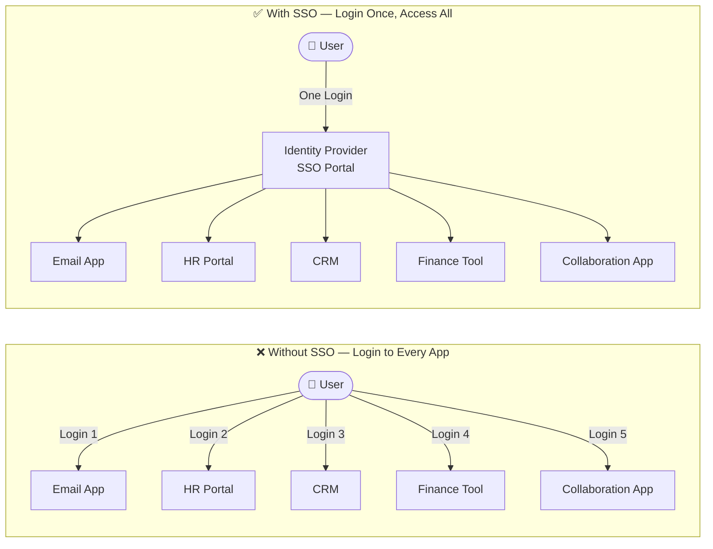
```mermaid
flowchart LR
    subgraph WithoutSSO["❌ Without SSO — Login to Every App"]
        U1([👤 User]) -->|Login 1| A1[Email App]
        U1 -->|Login 2| A2[HR Portal]
        U1 -->|Login 3| A3[CRM]
        U1 -->|Login 4| A4[Finance Tool]
        U1 -->|Login 5| A5[Collaboration App]
    end

    subgraph WithSSO["✅ With SSO — Login Once, Access All"]
        U2([👤 User]) -->|One Login| IDP[Identity Provider\nSSO Portal]
        IDP --> B1[Email App]
        IDP --> B2[HR Portal]
        IDP --> B3[CRM]
        IDP --> B4[Finance Tool]
        IDP --> B5[Collaboration App]
    end
```

### Problems SSO solves

| Problem | Without SSO | With SSO |
|---|---|---|
| Password fatigue | 10+ passwords to remember | 1 strong password |
| Weak per-app passwords | Users reuse or simplify | Enforced strength centrally |
| Slow login experience | Re-enter credentials per app | Seamless, transparent |
| Security gaps | MFA only on some apps | MFA enforced once at IdP |
| Offboarding | Disable 10+ accounts | Disable 1 IdP account |

### Problems SSO creates if done poorly

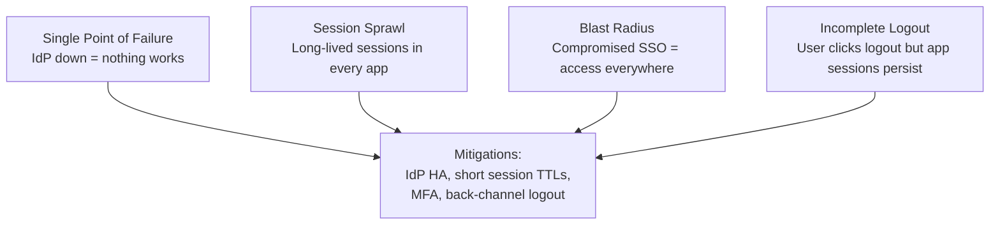
```mermaid
flowchart TD
    RISK1[Single Point of Failure\nIdP down = nothing works]
    RISK2[Session Sprawl\nLong-lived sessions in every app]
    RISK3[Blast Radius\nCompromised SSO = access everywhere]
    RISK4[Incomplete Logout\nUser clicks logout but app sessions persist]

    RISK1 & RISK2 & RISK3 & RISK4 --> MITIGATION[Mitigations:\nIdP HA, short session TTLs,\nMFA, back-channel logout]
```

---

## 2. How SSO Works — Core Concepts

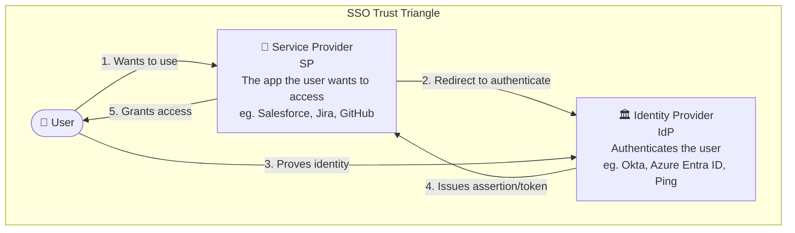
```mermaid
flowchart TD
    subgraph Triangle["SSO Trust Triangle"]
        USER([👤 User])
        IDP[🏛️ Identity Provider\nIdP\nAuthenticates the user\neg. Okta, Azure Entra ID, Ping]
        SP[📱 Service Provider\nSP\nThe app the user wants to access\neg. Salesforce, Jira, GitHub]

        USER -->|1. Wants to use| SP
        SP -->|2. Redirect to authenticate| IDP
        USER -->|3. Proves identity| IDP
        IDP -->|4. Issues assertion/token| SP
        SP -->|5. Grants access| USER
    end
```

| Concept | Simple Meaning |
|---|---|
| **Identity Provider (IdP)** | The authority that authenticates users and issues proof of identity |
| **Service Provider (SP)** | The application that trusts the IdP and grants access based on its assertion |
| **Assertion / Token** | Signed proof from the IdP saying "this user is authenticated and has these attributes" |
| **Trust Relationship** | Pre-configured agreement between IdP and SP — exchange of certificates and metadata |

---

## 3. SAML 2.0 SSO in Depth

**SAML (Security Assertion Markup Language)** is the enterprise standard for browser-based SSO. It passes XML assertions between IdP and SP.

### 3.1 SP-Initiated Flow (most common)

The user starts at the app (SP), gets redirected to the IdP, authenticates, and comes back.

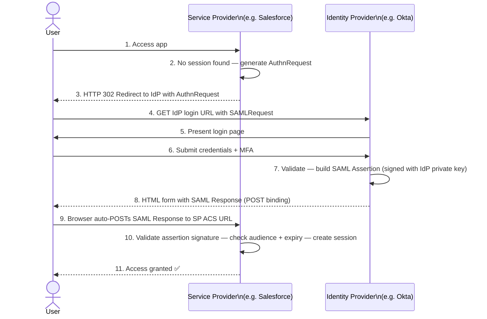
```mermaid
sequenceDiagram
    actor User
    participant SP as Service Provider\n(e.g. Salesforce)
    participant IdP as Identity Provider\n(e.g. Okta)

    User->>SP: 1. Access app
    SP->>SP: 2. No session found — generate AuthnRequest
    SP-->>User: 3. HTTP 302 Redirect to IdP with AuthnRequest
    User->>IdP: 4. GET IdP login URL with SAMLRequest
    IdP->>User: 5. Present login page
    User->>IdP: 6. Submit credentials + MFA
    IdP->>IdP: 7. Validate — build SAML Assertion (signed with IdP private key)
    IdP-->>User: 8. HTML form with SAML Response (POST binding)
    User->>SP: 9. Browser auto-POSTs SAML Response to SP ACS URL
    SP->>SP: 10. Validate assertion signature — check audience + expiry — create session
    SP-->>User: 11. Access granted ✅
```

**Key SAML elements:**
- **AuthnRequest** — SP's request to the IdP to authenticate the user
- **SAML Response** — IdP's reply containing the signed Assertion
- **Assertion** — the core payload: who the user is, when they authenticated, what attributes they have
- **ACS URL** (Assertion Consumer Service) — the SP endpoint that receives the SAML Response

### 3.2 IdP-Initiated Flow

The user starts at the IdP portal, clicks an app tile, and is sent directly to the SP.

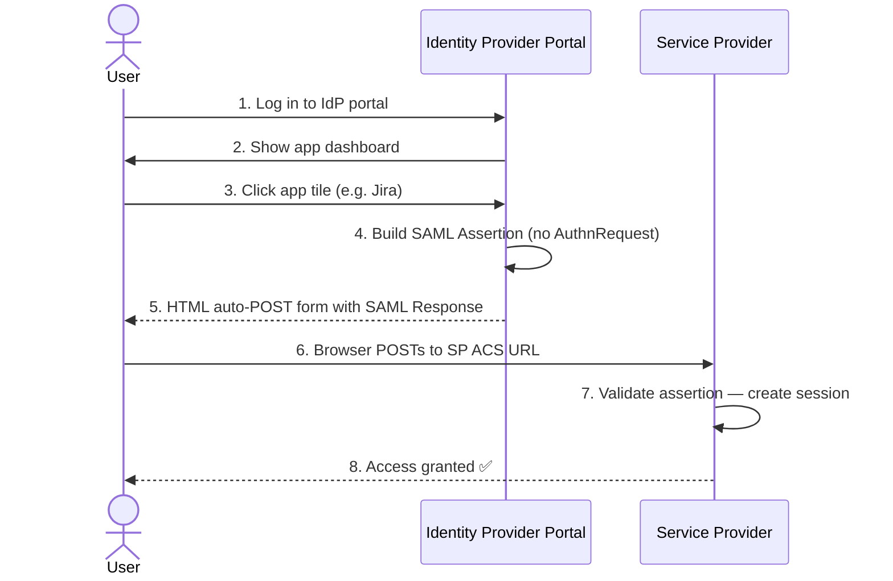
```mermaid
sequenceDiagram
    actor User
    participant IdP as Identity Provider Portal
    participant SP as Service Provider

    User->>IdP: 1. Log in to IdP portal
    IdP->>User: 2. Show app dashboard
    User->>IdP: 3. Click app tile (e.g. Jira)
    IdP->>IdP: 4. Build SAML Assertion (no AuthnRequest)
    IdP-->>User: 5. HTML auto-POST form with SAML Response
    User->>SP: 6. Browser POSTs to SP ACS URL
    SP->>SP: 7. Validate assertion — create session
    SP-->>User: 8. Access granted ✅
```

> **Security note:** IdP-initiated flows are less secure — SPs cannot validate a `RelayState` or verify the request came from a legitimate SP session.

### 3.3 SAML Metadata Exchange

Before SSO works, the IdP and SP must exchange configuration via **metadata XML**.

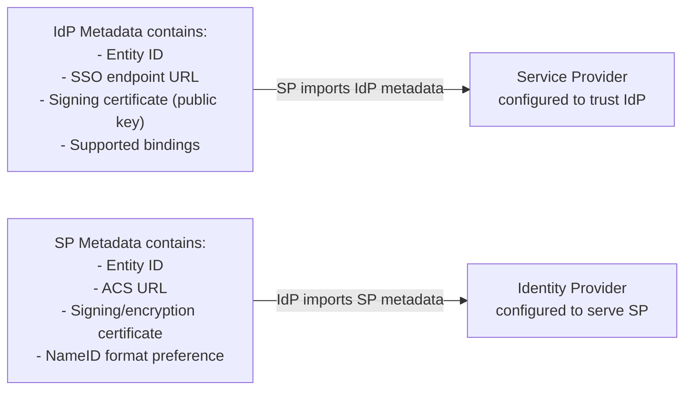
```mermaid
flowchart LR
    IDP_META["IdP Metadata contains:\n- Entity ID\n- SSO endpoint URL\n- Signing certificate (public key)\n- Supported bindings"]

    SP_META["SP Metadata contains:\n- Entity ID\n- ACS URL\n- Signing/encryption certificate\n- NameID format preference"]

    IDP_META -->|SP imports IdP metadata| SP[Service Provider\nconfigured to trust IdP]
    SP_META -->|IdP imports SP metadata| IDP[Identity Provider\nconfigured to serve SP]
```

---

## 4. OIDC / OAuth SSO in Depth

**OpenID Connect (OIDC)** builds an authentication layer on top of OAuth 2.0 — JSON-based, mobile-friendly, and API-ready.

### 4.1 Authorization Code Flow with PKCE

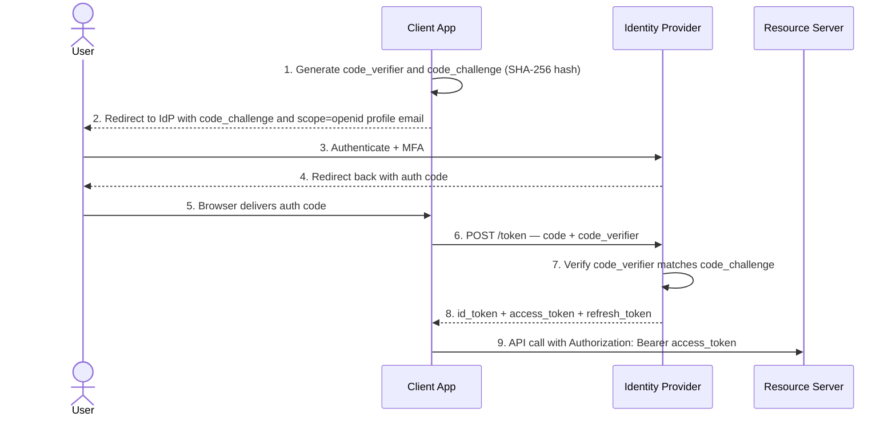
```mermaid
sequenceDiagram
    actor User
    participant App as Client App
    participant IdP as Identity Provider
    participant API as Resource Server

    App->>App: 1. Generate code_verifier and code_challenge (SHA-256 hash)
    App-->>User: 2. Redirect to IdP with code_challenge and scope=openid profile email
    User->>IdP: 3. Authenticate + MFA
    IdP-->>User: 4. Redirect back with auth code
    User->>App: 5. Browser delivers auth code
    App->>IdP: 6. POST /token — code + code_verifier
    IdP->>IdP: 7. Verify code_verifier matches code_challenge
    IdP-->>App: 8. id_token + access_token + refresh_token
    App->>API: 9. API call with Authorization: Bearer access_token
```

### 4.2 Token Types

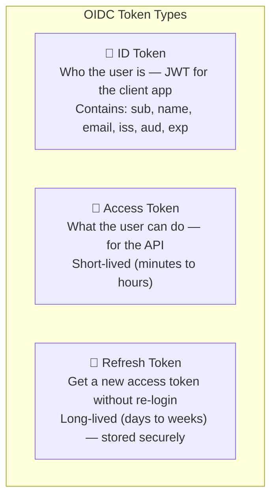
```mermaid
flowchart TD
    subgraph Tokens["OIDC Token Types"]
        IT["🪪 ID Token\nWho the user is — JWT for the client app\nContains: sub, name, email, iss, aud, exp"]
        AT["🔑 Access Token\nWhat the user can do — for the API\nShort-lived (minutes to hours)"]
        RT["🔄 Refresh Token\nGet a new access token without re-login\nLong-lived (days to weeks) — stored securely"]
    end
```

### 4.3 ID Token Anatomy

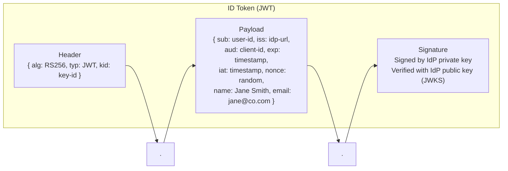
```mermaid
flowchart LR
    subgraph JWT["ID Token (JWT)"]
        H["Header\n{ alg: RS256, typ: JWT, kid: key-id }"]
        P["Payload\n{ sub: user-id, iss: idp-url,\n  aud: client-id, exp: timestamp,\n  iat: timestamp, nonce: random,\n  name: Jane Smith, email: jane@co.com }"]
        S["Signature\nSigned by IdP private key\nVerified with IdP public key (JWKS)"]
    end
    H --> DOT1[.] --> P --> DOT2[.] --> S
```

---

## 5. SAML vs OIDC — When to Use Which

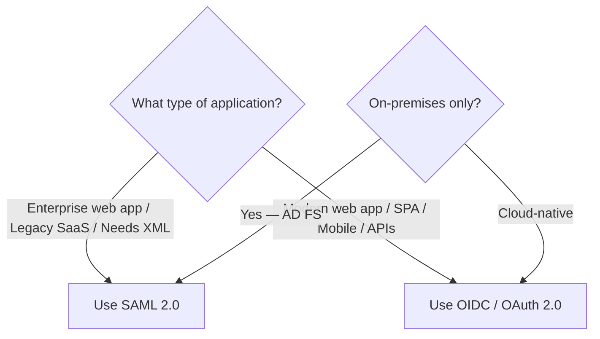
```mermaid
flowchart TD
    Q1{What type of application?} -->|Enterprise web app / Legacy SaaS / Needs XML| SAML[Use SAML 2.0]
    Q1 -->|Modern web app / SPA / Mobile / APIs| OIDC[Use OIDC / OAuth 2.0]
    Q2{On-premises only?} -->|Yes — AD FS| SAML
    Q2 -->|Cloud-native| OIDC
```

| Feature | SAML 2.0 | OIDC |
|---|---|---|
| Format | XML | JSON / JWT |
| Mobile support | Poor | Excellent |
| API-friendly | No | Yes |
| Token type | XML Assertion | ID Token + Access Token |
| Complexity | High | Moderate |
| Ecosystem | Enterprise legacy | Modern cloud |

---

## 6. SSO Session Management

SSO involves **two separate sessions** that must be managed independently.

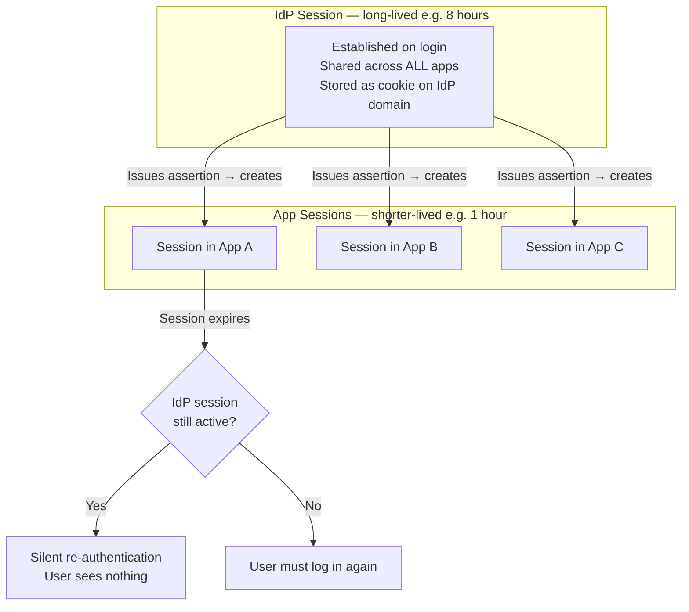
```mermaid
flowchart TD
    subgraph IdP_Session["IdP Session — long-lived e.g. 8 hours"]
        IS[Established on login\nShared across ALL apps\nStored as cookie on IdP domain]
    end

    subgraph SP_Sessions["App Sessions — shorter-lived e.g. 1 hour"]
        SS1[Session in App A]
        SS2[Session in App B]
        SS3[Session in App C]
    end

    IS -->|Issues assertion → creates| SS1 & SS2 & SS3

    SS1 -->|Session expires| SILENT{IdP session\nstill active?}
    SILENT -->|Yes| RE_AUTH[Silent re-authentication\nUser sees nothing]
    SILENT -->|No| LOGIN[User must log in again]
```

**Session timeout best practice:**

| Layer | Idle Timeout | Absolute Timeout |
|---|---|---|
| IdP session | 2 hours | 8 hours |
| Standard app session | 30 minutes | 1 hour |
| Privileged app session | 15 minutes | 30 minutes |

---

## 7. SSO Logout in Depth

Logout is the hardest part of SSO. Simply clearing one session does not log the user out of everything.

### 7.1 Front-Channel Logout

The browser is redirected through each SP's logout endpoint in sequence.

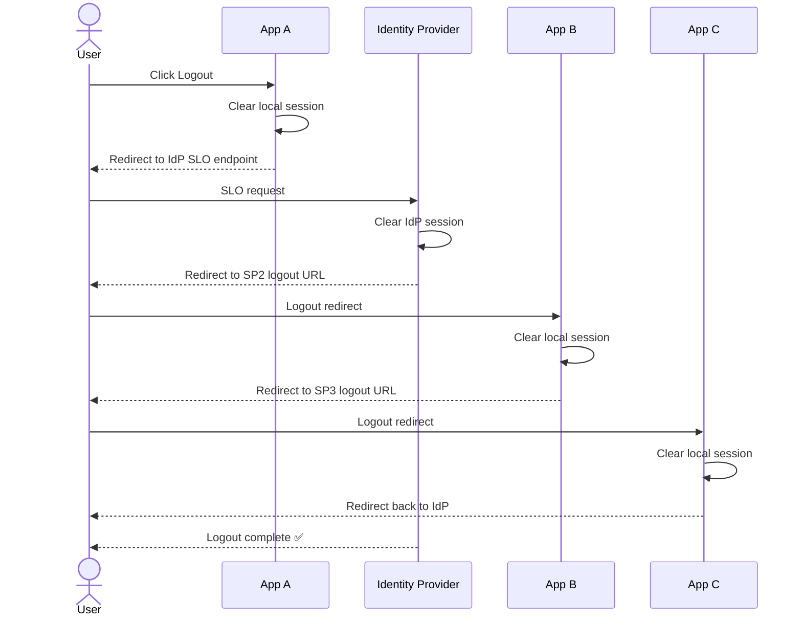
```mermaid
sequenceDiagram
    actor User
    participant SP1 as App A
    participant IdP as Identity Provider
    participant SP2 as App B
    participant SP3 as App C

    User->>SP1: Click Logout
    SP1->>SP1: Clear local session
    SP1-->>User: Redirect to IdP SLO endpoint
    User->>IdP: SLO request
    IdP->>IdP: Clear IdP session
    IdP-->>User: Redirect to SP2 logout URL
    User->>SP2: Logout redirect
    SP2->>SP2: Clear local session
    SP2-->>User: Redirect to SP3 logout URL
    User->>SP3: Logout redirect
    SP3->>SP3: Clear local session
    SP3-->>User: Redirect back to IdP
    IdP-->>User: Logout complete ✅
```

### 7.2 Back-Channel Logout

The IdP contacts each SP's logout endpoint directly — no browser involved. More reliable.

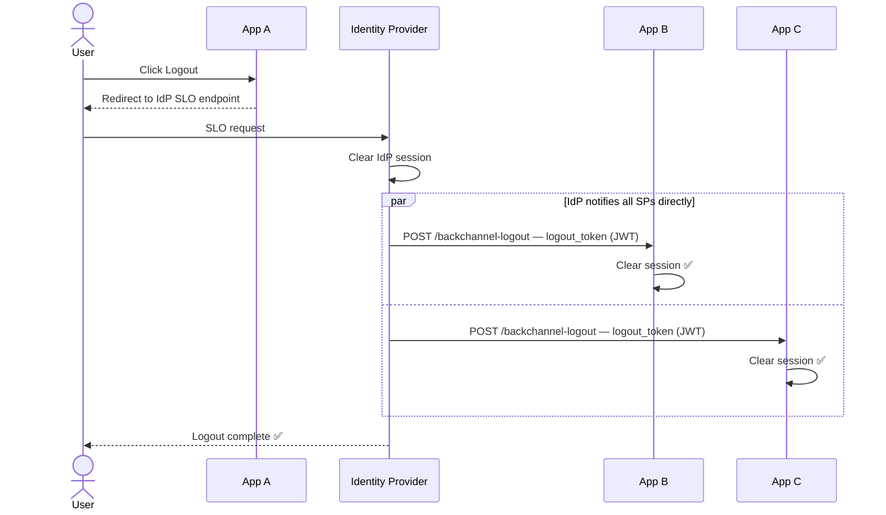
```mermaid
sequenceDiagram
    actor User
    participant SP1 as App A
    participant IdP as Identity Provider
    participant SP2 as App B
    participant SP3 as App C

    User->>SP1: Click Logout
    SP1-->>User: Redirect to IdP SLO endpoint
    User->>IdP: SLO request
    IdP->>IdP: Clear IdP session

    par IdP notifies all SPs directly
        IdP->>SP2: POST /backchannel-logout — logout_token (JWT)
        SP2->>SP2: Clear session ✅
    and
        IdP->>SP3: POST /backchannel-logout — logout_token (JWT)
        SP3->>SP3: Clear session ✅
    end

    IdP-->>User: Logout complete ✅
```

### 7.3 Why Logout is Hard

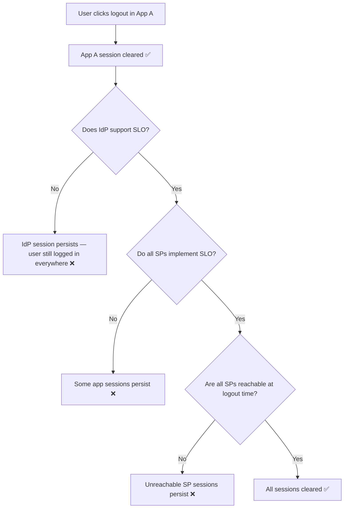
```mermaid
flowchart TD
    PROBLEM[User clicks logout in App A] --> CLEARED[App A session cleared ✅]
    CLEARED --> Q1{Does IdP support SLO?}
    Q1 -->|No| GAP1[IdP session persists — user still logged in everywhere ❌]
    Q1 -->|Yes| Q2{Do all SPs implement SLO?}
    Q2 -->|No| GAP2[Some app sessions persist ❌]
    Q2 -->|Yes| Q3{Are all SPs reachable at logout time?}
    Q3 -->|No| GAP3[Unreachable SP sessions persist ❌]
    Q3 -->|Yes| SUCCESS[All sessions cleared ✅]
```

| | Front-Channel | Back-Channel |
|---|---|---|
| Messenger | User's browser | Direct server call |
| Reliability | Lower — browser must visit each SP | Higher — server-to-server |
| Privacy | Browser URLs visible | Hidden from browser |
| Complexity | Simpler to implement | Requires logout endpoint on each SP |

---

## 8. Enterprise SSO Patterns

### Cloud-Only SSO

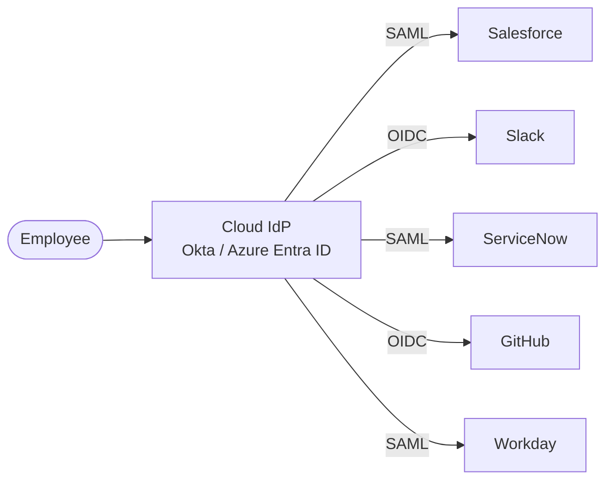
```mermaid
flowchart LR
    USER([Employee]) --> IDP[Cloud IdP\nOkta / Azure Entra ID]
    IDP -->|SAML| APP1[Salesforce]
    IDP -->|OIDC| APP2[Slack]
    IDP -->|SAML| APP3[ServiceNow]
    IDP -->|OIDC| APP4[GitHub]
    IDP -->|SAML| APP5[Workday]
```

### Hybrid SSO (On-Prem + Cloud)

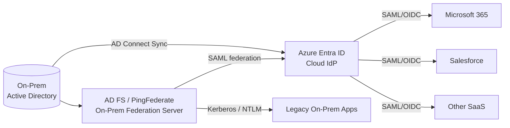
```mermaid
flowchart LR
    AD[(On-Prem\nActive Directory)] -->|AD Connect Sync| AZURE[Azure Entra ID\nCloud IdP]
    AD --> ADFS[AD FS / PingFederate\nOn-Prem Federation Server]
    ADFS -->|SAML federation| AZURE

    AZURE -->|SAML/OIDC| SAAS1[Microsoft 365]
    AZURE -->|SAML/OIDC| SAAS2[Salesforce]
    AZURE -->|SAML/OIDC| SAAS3[Other SaaS]
    ADFS -->|Kerberos / NTLM| LEGACY[Legacy On-Prem Apps]
```

### Header-Based SSO for Legacy Apps

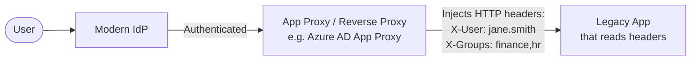
```mermaid
flowchart LR
    USER([User]) --> IDP[Modern IdP]
    IDP -->|Authenticated| PROXY[App Proxy / Reverse Proxy\ne.g. Azure AD App Proxy]
    PROXY -->|Injects HTTP headers:\nX-User: jane.smith\nX-Groups: finance,hr| LEGACY[Legacy App\nthat reads headers]
```

---

## 9. Social Login as SSO

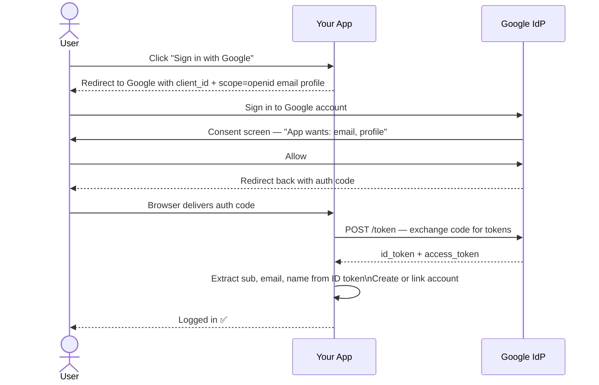
```mermaid
sequenceDiagram
    actor User
    participant App as Your App
    participant Google as Google IdP

    User->>App: Click "Sign in with Google"
    App-->>User: Redirect to Google with client_id + scope=openid email profile
    User->>Google: Sign in to Google account
    Google->>User: Consent screen — "App wants: email, profile"
    User->>Google: Allow
    Google-->>User: Redirect back with auth code
    User->>App: Browser delivers auth code
    App->>Google: POST /token — exchange code for tokens
    Google-->>App: id_token + access_token
    App->>App: Extract sub, email, name from ID token\nCreate or link account
    App-->>User: Logged in ✅
```

### Account Linking

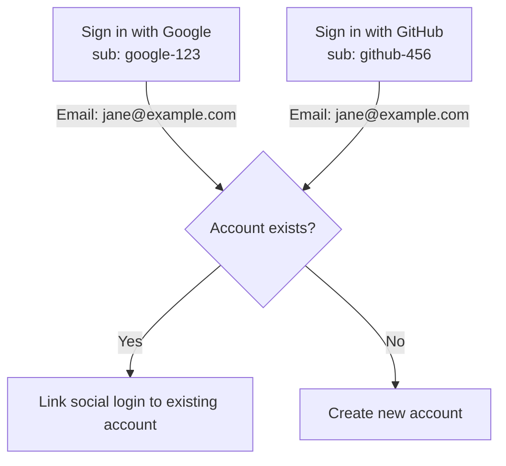
```mermaid
flowchart TD
    GOOGLE[Sign in with Google\nsub: google-123] -->|Email: jane@example.com| MATCH{Account exists?}
    GITHUB[Sign in with GitHub\nsub: github-456] -->|Email: jane@example.com| MATCH
    MATCH -->|Yes| LINK[Link social login to existing account]
    MATCH -->|No| CREATE[Create new account]
```

---

## 10. Enterprise SSO vs Customer SSO (CIAM)

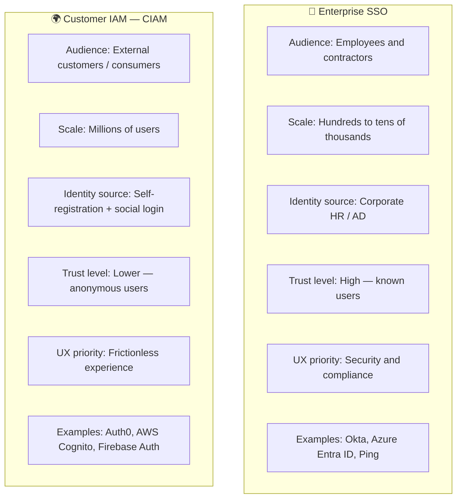
```mermaid
flowchart TD
    subgraph Enterprise["🏢 Enterprise SSO"]
        E1[Audience: Employees and contractors]
        E2[Scale: Hundreds to tens of thousands]
        E3[Identity source: Corporate HR / AD]
        E4[Trust level: High — known users]
        E5[UX priority: Security and compliance]
        E6[Examples: Okta, Azure Entra ID, Ping]
    end

    subgraph CIAM["🌍 Customer IAM — CIAM"]
        C1[Audience: External customers / consumers]
        C2[Scale: Millions of users]
        C3[Identity source: Self-registration + social login]
        C4[Trust level: Lower — anonymous users]
        C5[UX priority: Frictionless experience]
        C6[Examples: Auth0, AWS Cognito, Firebase Auth]
    end
```

| Dimension | Enterprise SSO | CIAM |
|---|---|---|
| Users | Employees | Customers |
| Scale | Thousands | Millions |
| Identity Source | HR / AD | Self-registration, social |
| Onboarding | IT-provisioned | Self-service |
| Key concern | Compliance, audit | Conversion, UX |
| MFA | Mandatory | Optional / adaptive |

---

## 11. SSO Security Considerations

```mermaid
mindmap
  root((SSO Security))
    Blast Radius
      One compromised session = access to all apps
      Mitigate with short session TTLs
      Step-up MFA for sensitive apps
    Session Attacks
      Session fixation
      Session hijacking — steal session cookie
      Mitigate: Secure HttpOnly cookies, TLS only
    Token Attacks
      Token replay — reuse a valid token
      Token theft from browser or memory
      Mitigate: short expiry, nonce, audience check
    Redirect Attacks
      Open redirector — redirect_uri manipulation
      Mitigate: exact URI matching, no wildcards
    Infrastructure
      IdP certificate expiry — breaks all SSO
      IdP availability — deploy HA
```

---

## 12. SSO for APIs and Machine-to-Machine

### Token Propagation

```mermaid
sequenceDiagram
    actor User
    participant FE as Frontend
    participant GW as API Gateway
    participant SVC1 as Service A
    participant SVC2 as Service B

    User->>FE: User action
    FE->>GW: Authorization: Bearer access_token
    GW->>GW: Validate token + check scopes
    GW->>SVC1: Forward with same token
    SVC1->>SVC2: Internal call with same token
    SVC2-->>SVC1: Response
    SVC1-->>GW: Response
    GW-->>FE: Response
    FE-->>User: Display result
```

### Client Credentials (Machine-to-Machine)

```mermaid
sequenceDiagram
    participant SvcA as Service A
    participant IdP as Identity Provider
    participant SvcB as Service B

    SvcA->>IdP: POST /token — grant_type=client_credentials
    IdP-->>SvcA: access_token (no user involved)
    SvcA->>SvcB: API call with Bearer access_token
    SvcB-->>SvcA: Response ✅
```

---

## Quick Reference

### Protocol Comparison

| Feature | SAML 2.0 | OIDC | WS-Federation |
|---|---|---|---|
| Format | XML | JSON / JWT | XML |
| Primary use | Enterprise SSO | Modern SSO + APIs | Microsoft / ADFS |
| Token type | XML Assertion | ID Token + Access Token | Security Token (XML) |
| Mobile support | Poor | Excellent | Poor |
| Logout standard | SLO (front/back channel) | RP-Initiated Logout | WS-Federation signout |

### Secure SSO Deployment Checklist

| Area | What to Configure |
|---|---|
| **Authentication** | Enforce MFA at the IdP for all users |
| **Sessions** | IdP session: 8h max / 2h idle; App session: 1h max / 30min idle |
| **Tokens** | Short access token TTL (15–60 min); rotate refresh tokens |
| **Logout** | Implement back-channel logout; test SLO across all SPs |
| **Redirect URIs** | Exact URI match only — no wildcards, no open redirectors |
| **Certificates** | Monitor IdP signing cert expiry; automate rotation |
| **Availability** | IdP deployed HA; at least 2 nodes; monitor uptime |
| **Monitoring** | Alert on SSO failures, unusual logins, impossible travel |
| **Privileged apps** | Require step-up MFA even with active SSO session |

### Key Terms

| Concept | One-liner |
|---|---|
| **IdP** | Verifies identity and issues the signed token |
| **SP** | Provides the service and trusts the token |
| **SSO Session** | IdP-level session shared across all apps — longer-lived |
| **App Session** | SP-level session per app — shorter-lived |
| **Front-channel logout** | Browser-based logout relay — simpler but less reliable |
| **Back-channel logout** | Server-to-server logout — reliable, requires logout endpoint |
| **Social login** | Use Google/Apple/GitHub identity — OAuth + OIDC under the hood |
| **CIAM** | Customer-facing SSO — UX-first, millions of users |
